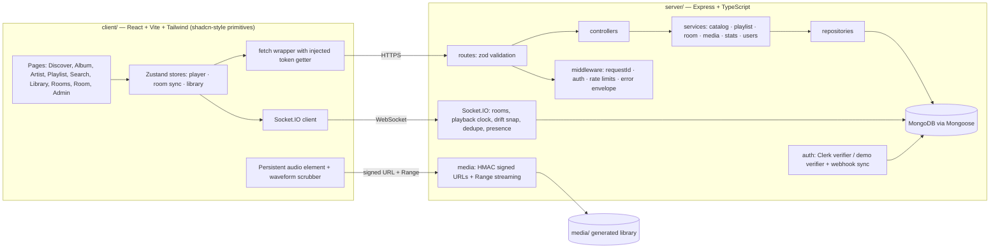

# CADENZA

A collaborative music streaming platform: browse a catalogue, build playlists, play tracks with a
synchronised waveform player, and — the part that makes it interesting — open a **listening room** where
several people share one queue and one playback clock, chat, and see who else is connected. The problem it
solves is the one Spotify's group session solves: keeping several listeners at exactly the same position in
the same track without trusting any client's clock, while still letting everyone queue music and talk about
it. Built as a MERN/TypeScript monorepo: Express + Mongoose + Socket.IO on the server, React + Vite +
Tailwind on the client, Clerk for identity, and a locally generated royalty-free sample library so the whole
thing runs end to end on a laptop with no third-party media and no cloud account.

## Architecture



Request path: `client` → `fetch` with a bearer token → `routes` (zod-validated) → `controller` →
`service` (authorization + business rules) → `repository` → Mongoose. Failures come back as one envelope:
`{ error: { code, message, details, requestId } }`.

Event path (listening room): the client emits `room:join` / `queue:add` / `playback:*` / `chat:message`
with a **client-generated event id**; the server checks membership, atomically claims the event id
(`rooms.processedEventIds` in Mongo for queue/chat, a bounded in-memory ring for playback), writes the new
authoritative state, and broadcasts it to the room. Clients never write playback state directly — they
receive an anchor (`positionMs` + `serverTs`) and derive the live position locally; a client that reports a
position more than `PLAYBACK_DRIFT_THRESHOLD_MS` away is snapped back.

## Tech stack

| Layer | Choices |
|---|---|
| Client | React 18, TypeScript, Vite 6, Tailwind CSS 3, shadcn/ui-style components on Radix primitives, Zustand, socket.io-client, lucide-react |
| Server | Node 22, Express 4, TypeScript, Mongoose 8, Socket.IO 4, zod, pino + pino-http, helmet, express-rate-limit, `@clerk/express` |
| Data | MongoDB (Atlas in production, `mongodb-memory-server` in tests/dev), text indexes for ranked search |
| Auth | Clerk session tokens in production; locally-signed demo sessions when `AUTH_MODE=demo` |
| Media | MP3s synthesised by `tools/generate-media.mjs` (ffmpeg/libmp3lame), served only through HMAC-signed short-lived URLs with HTTP Range support |
| Tests | Vitest, supertest, real socket.io clients, mongodb-memory-server, @testing-library/react + jsdom |
| Tooling | npm workspaces, ESLint 9 flat config, `tsc --noEmit`, GitHub Actions |

## How it works

**Catalogue and playback.** `GET /api/discover` builds the home rail from real rows. Playing a track first
calls `GET /api/songs/:id/stream-url`, which requires a session and returns
`/api/media/stream/<songId>?exp=<unix>&sig=<hmac>` — an HMAC-SHA256 signature over `songId:exp`, valid for
`MEDIA_URL_TTL_SECONDS`. The stream endpoint re-derives the signature, rejects tampered or expired tokens
(403/410), and then serves the file honouring a single `Range` window (206 + `Content-Range`) so seeking
works from an `<audio>` element that cannot send an `Authorization` header.

**Listening rooms.** Creating a room makes you the host. Joining over REST adds a membership row; the socket
handshake then verifies the same session token and `room:join` checks that membership before the socket
enters the Socket.IO room. The host alone can change the track (`playback:track`); any member can play,
pause, seek and queue. State changes broadcast `playback:state` (the authoritative anchor), `queue:updated`,
`chat:message` and `presence`. A reconnecting client emits `room:resync` and receives a full snapshot.

**Auth.** The production path is `@clerk/express`: `verifyToken` for session tokens, with a Clerk Backend API
lookup when the token carries no email claim, and `verifyWebhook` (Standard Webhooks signature) for the
`/api/webhooks/clerk` endpoint that mirrors users into Mongo. Both are injected through
`IdentityVerifier` / `WebhookVerifier` interfaces — tests and the e2e script substitute a documented
demo-session verifier and an HMAC webhook verifier, and the demo route 404s whenever `AUTH_MODE=clerk`, so
there is no bypass in the production path.

## Setup

```bash
npm ci                                   # installs both workspaces
cp .env.example .env                     # every value has a local default except the Clerk keys
npm run media:generate                   # regenerates media/ (already committed; needs ffmpeg)
docker compose -f docker-compose.dev.yml up -d   # or point MONGO_URI at Atlas
npm run seed --workspace server          # catalogue + demo users/playlists/room + 14 days of play events
npm run dev                              # API on :4000, client on :5173
```

**No mongod and no Docker?** `npm run build && npm run demo` boots an in-memory MongoDB, seeds it,
starts the built API on :4000 and the built client on :4173 — see `VERIFY.md` §4.

Environment variables (see `.env.example` for the annotated list):

| Variable | Default | Purpose |
|---|---|---|
| `NODE_ENV` / `PORT` / `LOG_LEVEL` | `development` / `4000` / `info` | runtime, port, pino level |
| `MONGO_URI` | `mongodb://127.0.0.1:27017/cadenza` | database connection string |
| `AUTH_MODE` | `clerk` | `clerk` = real Clerk tokens, `demo` = locally-signed demo sessions |
| `CLERK_SECRET_KEY`, `CLERK_WEBHOOK_SECRET`, `CLERK_PUBLISHABLE_KEY` | – | Clerk credentials (required when `AUTH_MODE=clerk`) |
| `ADMIN_EMAILS` | `admin@cadenza.dev` | emails granted the `admin` role on user provisioning |
| `MEDIA_DIR` | `./media` | audio library root |
| `MEDIA_SIGNING_SECRET` | dev placeholder | HMAC key for stream URLs |
| `MEDIA_URL_TTL_SECONDS` | `300` | stream URL lifetime |
| `CORS_ORIGINS` | `http://localhost:5173,http://localhost:4173` | strict allowlist for API + socket handshake |
| `PLAYBACK_DRIFT_THRESHOLD_MS` | `750` | drift beyond this is snapped back |
| `RATE_LIMIT_*` | see `.env.example` | HTTP rate-limit buckets (auth/write/read) |
| `SOCKET_CHAT_BURST`, `SOCKET_CHAT_REFILL_PER_SEC`, `SOCKET_QUEUE_BURST`, `SOCKET_QUEUE_REFILL_PER_SEC` | `10/2`, `30/5` | per-socket token buckets for chat and queue events |
| `VITE_API_URL`, `VITE_SOCKET_URL`, `VITE_AUTH_MODE`, `VITE_CLERK_PUBLISHABLE_KEY` | local defaults | client build-time config |

**Demo mode.** With no Clerk keys the app boots with `AUTH_MODE=demo` / `VITE_AUTH_MODE=demo`: the sign-in
page offers two demo personas (`demo@cadenza.dev`, `admin@cadenza.dev`) and the API issues a locally-signed
12-hour session. The UI shows a permanent amber **DEMO MODE** banner, and `POST /api/auth/demo-session`
returns 404 as soon as `AUTH_MODE=clerk`. Real Clerk stays wired for real keys.

## API reference

| Method | Path | Auth | Description |
|---|---|---|---|
| GET | `/api/health` | – | liveness: status, version, uptime, auth mode, realtime flag |
| GET | `/api/health/ready` | – | readiness: 200 when Mongo is connected, else 503 |
| POST | `/api/auth/demo-session` | – | issue a demo session (404 unless `AUTH_MODE=demo`) |
| GET | `/api/auth/me` | session | the caller's mirrored user row + roles |
| POST | `/api/webhooks/clerk` | signature | Clerk user sync (`user.created/updated/deleted`) |
| GET | `/api/discover` | – | featured albums, most-played songs, artists |
| GET | `/api/songs` | – | paginated browse: `search`, `albumId`, `artistId`, `sort`, `page`, `limit` |
| GET | `/api/songs/:id` | – | one song with waveform peaks and play count |
| GET | `/api/songs/:id/stream-url` | session | mint a signed, short-lived stream URL |
| POST | `/api/songs/:id/play` | session | record a play event (source + optional room) |
| GET | `/api/media/stream/:id` | signature | stream audio with HTTP Range support |
| GET | `/api/media/cover/:kind/:id` | – | cover art (`song` \| `album` \| `artist`) |
| GET | `/api/artists`, `/api/artists/:id` | – | artist list; artist detail with albums + top songs |
| GET | `/api/albums`, `/api/albums/:id` | – | album list; album detail with ordered tracks |
| GET | `/api/search?q=` | – | ranked full-text search (songs, albums, artists) |
| GET | `/api/playlists` | optional | `scope=mine\|public\|all`, paginated |
| POST | `/api/playlists` | session | create (name, description, visibility) |
| GET | `/api/playlists/:id` | optional | read (owner, public, or admin) |
| PATCH / DELETE | `/api/playlists/:id` | owner/admin | rename, change visibility, delete |
| POST | `/api/playlists/:id/songs` | owner/admin | add a track (409 on duplicate) |
| DELETE | `/api/playlists/:id/songs/:songId` | owner/admin | remove a track |
| PUT | `/api/playlists/:id/order` | owner/admin | replace the track order (drag-to-reorder) |
| GET | `/api/rooms` | optional | active public rooms with member/queue counts |
| POST | `/api/rooms` | session | create a room (creator becomes host) |
| GET | `/api/rooms/:id` | session | room snapshot + recent chat |
| POST | `/api/rooms/:id/join`, `/leave` | session | join (idempotent) / leave (host handover) |
| POST | `/api/rooms/:id/queue` | member | queue a track (idempotent by `eventId`) |
| DELETE | `/api/rooms/:id/queue/:songId` | member | remove a queued track |
| GET | `/api/rooms/:id/messages` | member | chat history, keyset pagination (`before`, `limit`) |
| GET | `/api/stats/overview` \| `/plays` \| `/top-tracks` \| `/active-rooms` | admin | dashboard aggregations |

### Socket contract

| Direction | Event | Payload | Notes |
|---|---|---|---|
| C→S | `room:join` | `{ roomId }` | membership required; replies with a full snapshot |
| C→S | `room:leave` | `{ roomId }` | broadcasts presence |
| C→S | `room:resync` | `{ roomId }` | full state after a reconnect |
| C→S | `playback:play` \| `pause` \| `seek` | `{ roomId, positionMs, eventId }` | member-only, deduped by `eventId` |
| C→S | `playback:track` | `{ roomId, songId, eventId }` | **host only** (403 otherwise) |
| C→S | `playback:report` | `{ roomId, positionMs, eventId }` | drift check; may trigger `playback:snap` |
| C→S | `queue:add` \| `queue:remove` | `{ roomId, songId, eventId }` | atomic idempotency in Mongo |
| C→S | `chat:message` | `{ roomId, body, eventId, clientSentAt }` | persisted, per-socket rate limited |
| S→C | `room:snapshot` | `{ room, messages }` | full state (join/resync) |
| S→C | `playback:state` | `{ trackId, isPlaying, positionMs, serverTs, updatedBy }` | authoritative anchor |
| S→C | `playback:snap` | anchor + `{ reason }` | sent only to the drifting client |
| S→C | `queue:updated` | `{ roomId, queue }` | after any queue mutation |
| S→C | `track:changed` | `{ roomId, songId, changedBy }` | host changed the track |
| S→C | `chat:message` | `{ message }` | broadcast to the room |
| S→C | `presence` | `{ roomId, connectedUserIds }` | multi-tab aware |
| S→C | `room:error` | `{ ok: false, error, roomId }` | rejection (authz, validation, rate limit) |

## Testing

```bash
npm run lint          # eslint, zero warnings, both workspaces
npm run typecheck     # tsc --noEmit (server build config + server tests + client)
npm test              # vitest: server (unit + REST integration + realtime sockets) then client
npm run build         # tsc → server/dist, vite build → client/dist
npm run e2e           # boots the built API + in-memory Mongo and walks the real HTTP + socket flow
npm run latency       # 220 events per channel, prints p50/p95 propagation latency
```

The server suite boots one real `mongod` (mongodb-memory-server, version pinned to 8.2.6) and gives each
test file its own database. Socket tests connect two and three real `socket.io-client` instances and assert
propagation, authz rejection, queue ordering, drift snapping, idempotency, resync after a forced disconnect
and room isolation. Client tests cover the queue and room-sync reducers, the player/room/library stores
(with the socket layer mocked at the module boundary) and the player, track list, waveform and sign-in
components.

## Measured results

All numbers below come from commands run on the author's machine (Windows 11, Node v22.23.2) and are copied
verbatim into `VERIFY.md`.

| Measurement | Result |
|---|---|
| `npm run lint` | 0 errors, 0 warnings (server + client) |
| `npm run typecheck` | 0 errors (`tsc` server build config, server test config, client) |
| `npm run test` (server) | 15 files, 169 tests passed |
| `npm run test` (client) | 11 files, 96 tests passed |
| `npm run build` | server `tsc` clean; client 1787 modules → 479.87 kB JS (146.78 kB gzip) + 21.60 kB CSS |
| `npm run e2e` | 20/20 steps PASS, wall clock 2.20 s |
| `npm run latency` | see the propagation table in `VERIFY.md` |
| `bash scripts/secret_scan.sh` | clean (and verified to catch an injected canary) |
| Sample library | 8 synthesised tracks, 2.03 MB of MP3 (96 kbps mono, 44.1 kHz), 120-bucket peaks each |
| Cold `mongod` download | 781 MB from fastdl.mongodb.org, 326 s (one-off, cached afterwards) |
| Clean checkout | `git clone` → `npm ci` → all five gates green (VERIFY.md §1.8) |

## Limitations and what is not built yet

- **No live deployment.** The repo is verified locally only; `docs/DEPLOY.md` lists exactly what a Vercel +
  Render + Atlas + Clerk deployment needs.
- **Single API instance.** Room state is persisted in Mongo and re-read on resync, but the in-memory
  presence registry and the playback dedupe ring are per-process; running two API instances behind a load
  balancer would need a Socket.IO adapter (Redis) to keep presence accurate.
- **No real audio streaming from object storage.** Files are served from a local `media/` directory; a
  production deployment needs a persistent disk or a signed-URL redirect to S3.
- **Chat is text only** — no typing indicators, reactions, edits or moderation tools.
- **Playlists are single-owner.** Collaborative playlists exist as a schema idea, not as a feature.
- **The sample library is synthesised**, deliberately: eight short loops, not a music catalogue.
- **Play events are counted, not timed.** `msPlayed` is stored but nothing measures real listening duration,
  so "plays" are play-starts.
- **No push notifications** when a room you are in changes track while you are away.

## License

MIT — see `LICENSE`.
